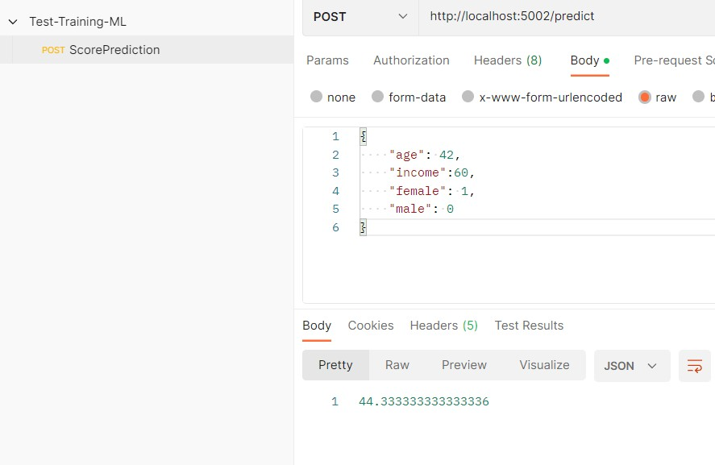

# Basic projet Machine Learning using FLASK in DOCKER
# Model as a service

## Build application docker
```docker command
docker build -t img-flask-ml .
```
## Run application docker

```docker command
docker run --name spending-score-prediction -d -p 5002:5000 img-flask-ml
```
## Test application


