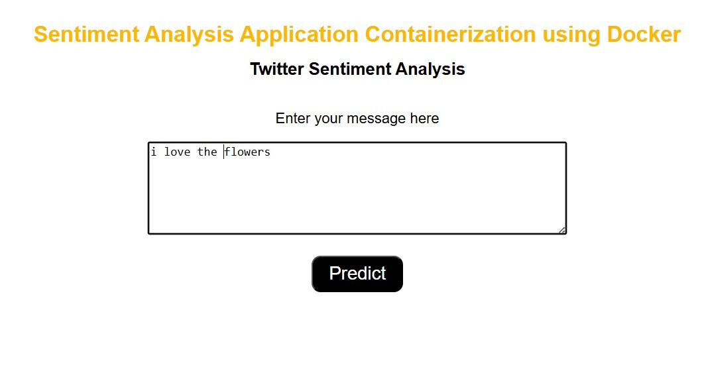
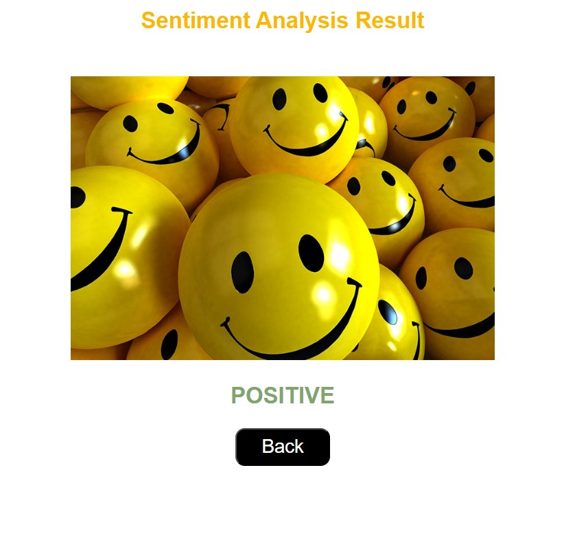

# Sentiment Analysis Application

“This is a sentiment analysis application that uses a logistic regression model to classify messages as positive or negative. The application is built with Flask and can be run inside a Docker container.”


## Requisitos

- Python 3.8 o superior
- Docker (opcional, para ejecutar la aplicación en un contenedor)

## Instalación

1. Training model 

    Instala las dependencias y ejecuta el script train.py:

    ```bash
    pip install -r requirements.txt
    python train.py

## Using  Docker

## Build application docker
```docker command
docker build -t img-flask-ml-senti .
```
## Run application docker

```docker command
docker run --name sentimental-prediction -d -p 5003:5000 img-flask-ml-senti
```
## Test application





